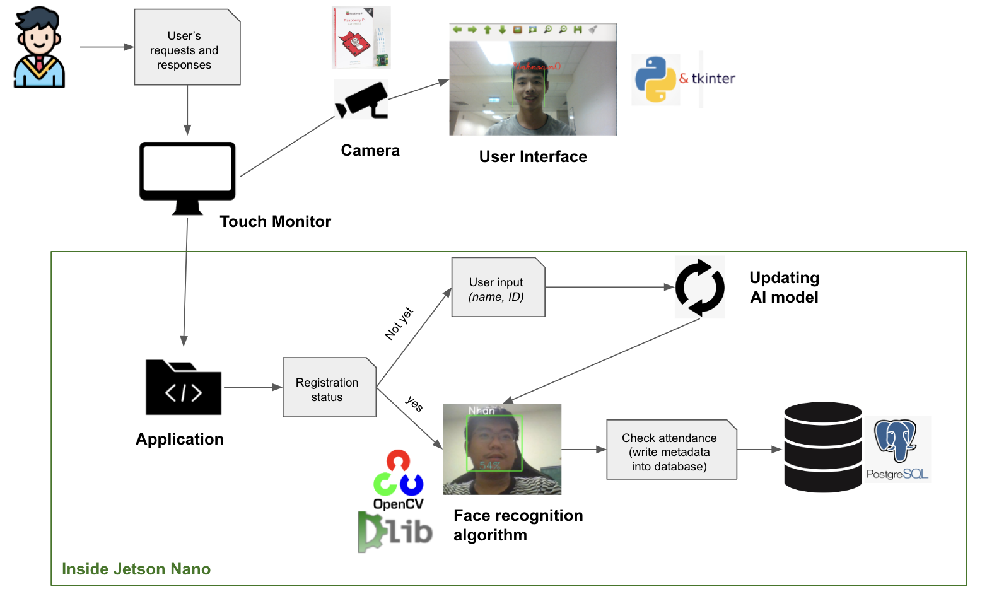
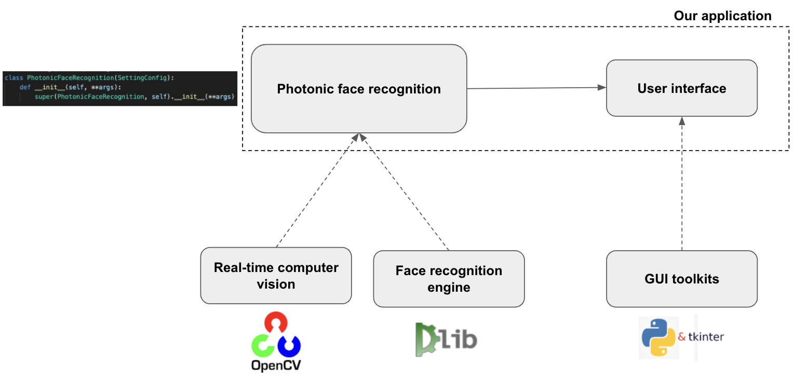
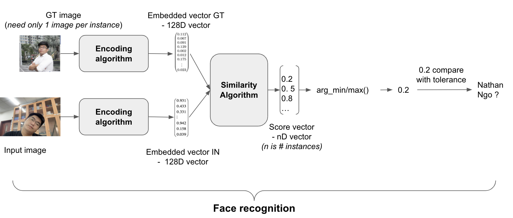

# Face-Recognition-Jetson-Nano (*Status: updating*)
This our project in Bio-Photonic class at **BME - International University - VNU**.

## 1. Project Architecture

### 1.1. Schematic

### 1.2. Repository
Our structure of this repository:

### 1.3. How our **Face Recognition** work
In this project, we used [dlib](http://dlib.net/)'s state-of-the-art face recognition built with deep learning and follwed open source of [ageitgey](https://github.com/ageitgey/face_recognition) to setup enviroments.

For more understand, read our [document](https://docs.google.com/presentation/d/1ubix9-0_nUYJHcTf9s-gZwm7NsP12SqhFFAGRUtJUmE/edit?usp=sharing).

## Setup 
Click [here](setup/README.md) for following our steps for setup this project.

